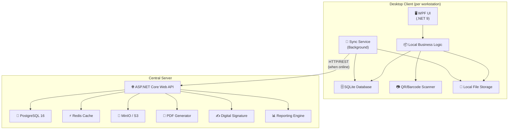
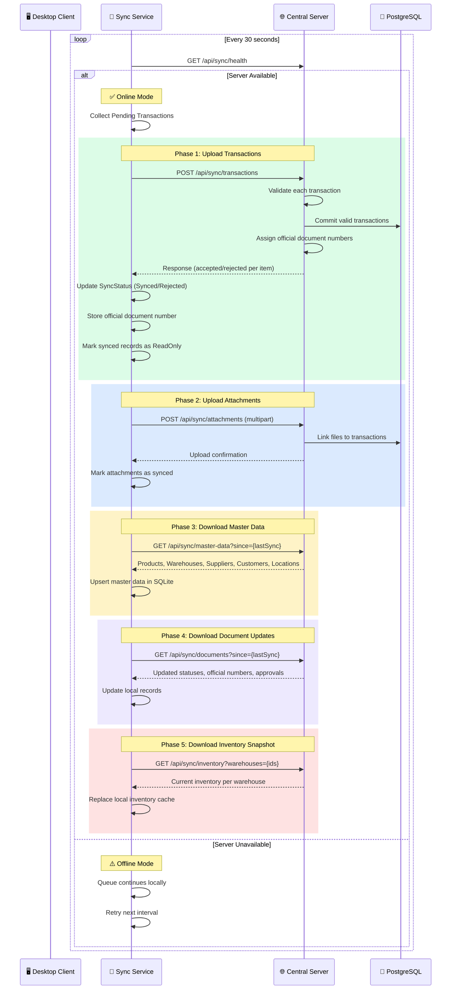
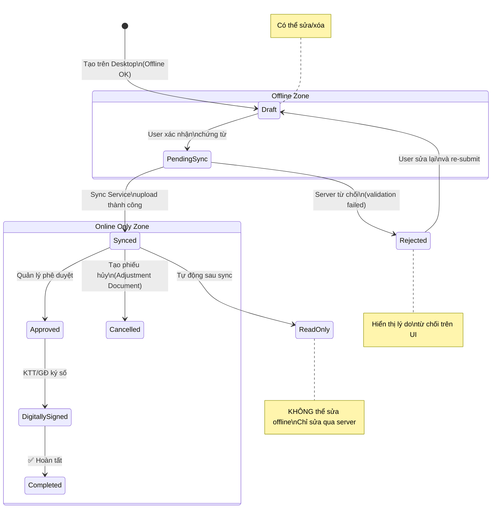
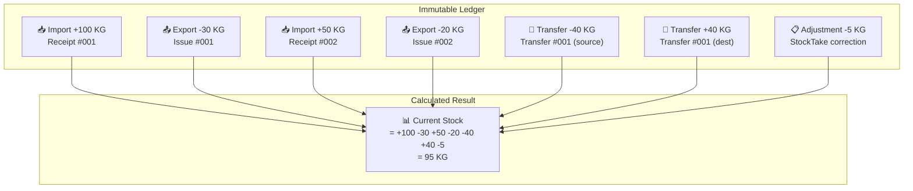
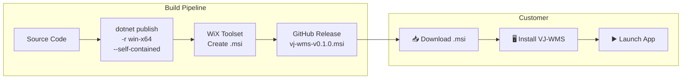
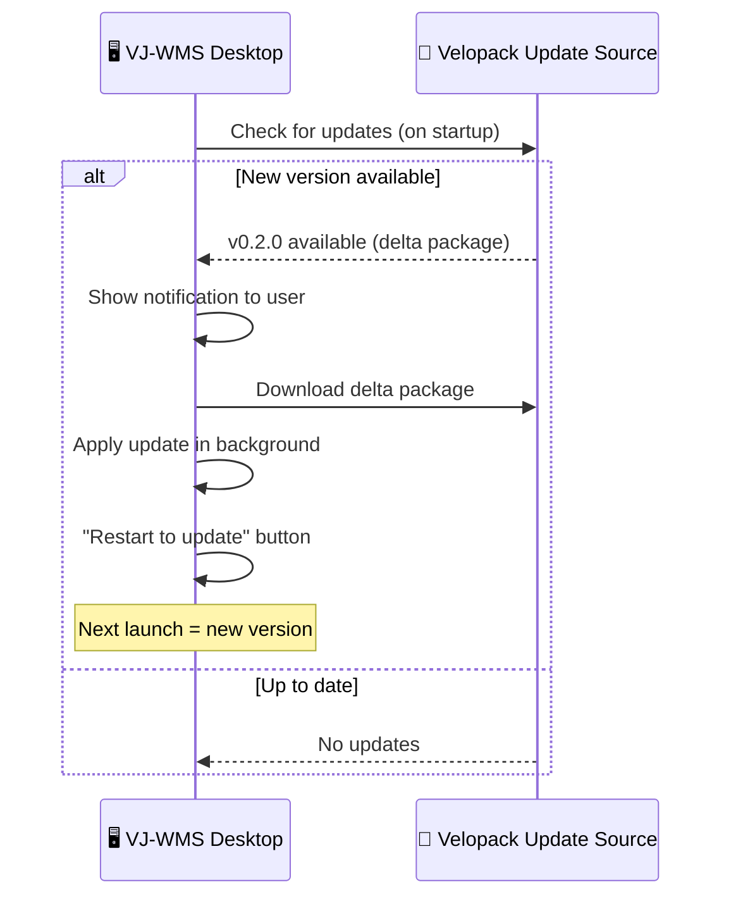
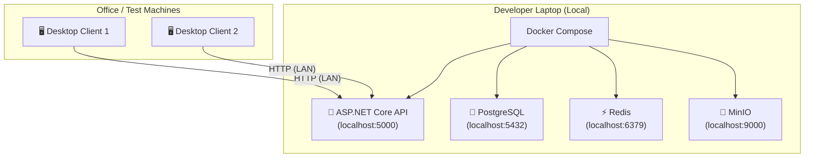
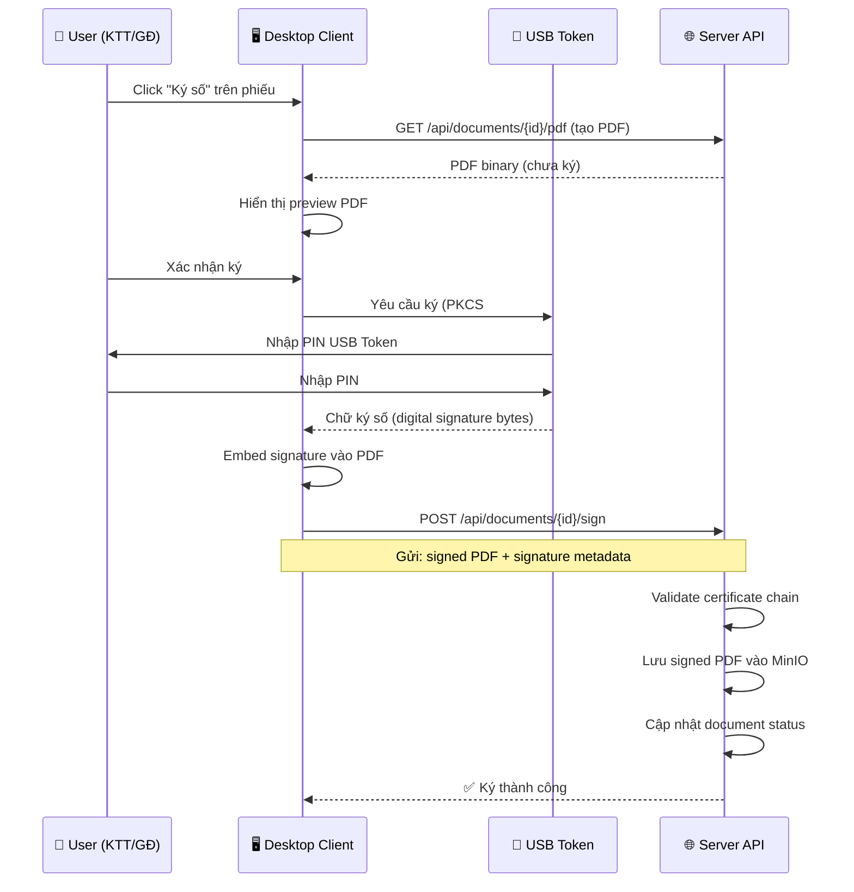

# VJ-WMS: Offline-First Desktop Warehouse Management System

## 1. Tổng Quan Kiến Trúc

Hệ thống Quản lý Kho **Offline-First** dành cho doanh nghiệp nội bộ, đảm bảo hoạt động liên tục ngay cả khi mất mạng.



### Triết lý thiết kế

| Nguyên tắc | Mô tả |
|---|---|
| **Offline-First** | Ứng dụng desktop hoạt động đầy đủ khi mất mạng |
| **Server = Source of Truth** | Server là nguồn dữ liệu chính thức duy nhất |
| **Immutable After Sync** | Chứng từ đã đồng bộ trở thành Read-Only, sửa bằng phiếu điều chỉnh |
| **Ledger-Based Inventory** | Tồn kho tính từ lịch sử giao dịch, không bao giờ sửa trực tiếp |
| **Eventual Consistency** | Dữ liệu sẽ nhất quán sau khi đồng bộ, không yêu cầu real-time |

---

## 2. Lựa Chọn Công Nghệ

### Desktop Client
| Công nghệ | Mục đích | Lý do |
|---|---|---|
| **.NET 9** | Runtime | LTS, hiệu năng cao, cross-compile |
| **WPF (XAML)** | UI Framework | Native Windows, rich controls, MVVM pattern |
| **CommunityToolkit.Mvvm** | MVVM Framework | Source generators, ObservableObject, RelayCommand |
| **SQLite + EF Core** | Local Database | Embedded, zero-config, offline storage |
| **Microsoft.Extensions.DI** | Dependency Injection | Tương thích ASP.NET Core patterns |
| **Microsoft.Extensions.Localization** | Internationalization | Song ngữ Việt-Anh (vi-VN / en-US) |
| **ZXing.Net** | QR/Barcode Scanning | Decode QR, Code128, EAN13 từ image file hoặc HID scanner |
| **Serilog** | Logging | Structured logging, file sink |
| **Polly** | Resilience | Retry, circuit breaker cho sync |
| **System.Net.Http** | HTTP Client | Gọi REST API server |
| **FluentValidation** | Validation | Validate input offline |

### Central Server
| Công nghệ | Mục đích | Lý do |
|---|---|---|
| **ASP.NET Core 9 Web API** | Backend Framework | High performance, enterprise-grade |
| **Entity Framework Core 9** | ORM | Code-first migrations, LINQ, PostgreSQL provider |
| **PostgreSQL 16** | Database chính | Quan hệ phức tạp, full-text search, JSONB |
| **Redis** | Caching & Session | Cache báo cáo, rate limiting |
| **MinIO** | File Storage | Tài liệu đính kèm, PDF generated |
| **QuestPDF** | PDF Generation | Fluent API, phiếu kho 3 liên |
| **MediatR** | CQRS/Mediator | Tách command/query, clean architecture |
| **FluentValidation** | Server validation | Validate transactions trước khi commit |
| **Serilog** | Structured Logging | Audit trail |
| **Swagger/OpenAPI** | API Documentation | Auto-generated API docs |
| **BCrypt.Net** | Password Hashing | Secure authentication |
| **jwt-bearer** | Authentication | Token-based auth cho desktop client |

### DevOps & Deployment
| Công nghệ | Mục đích |
|---|---|
| **Docker Compose** | Server containerization (local dev only) |
| **WiX Toolset / MSIX** | Desktop installer (.msi / .msix) |
| **Velopack** | Auto-update cho desktop client (replaces Squirrel) |
| **GitHub Actions** | CI/CD pipeline |

---

## 3. Kiến Trúc Chi Tiết

### 3.1. Offline vs Online Capability Matrix

| Chức năng | Offline | Online | Ghi chú |
|---|---|---|---|
| Đăng nhập (cached credentials) | ✅ | ✅ | Offline dùng hash đã cache |
| Tạo Phiếu nhập kho (Draft) | ✅ | ✅ | Lưu SQLite, SyncStatus=Pending |
| Tạo Phiếu xuất kho (Draft) | ✅ | ✅ | Lưu SQLite, SyncStatus=Pending |
| Tạo Luân chuyển kho (Draft) | ✅ | ✅ | Lưu SQLite, SyncStatus=Pending |
| Quét QR / Barcode | ✅ | ✅ | Decode local |
| Tra cứu tồn kho (snapshot) | ✅ | ✅ | Offline = dữ liệu sync gần nhất |
| Đính kèm tài liệu | ✅ | ✅ | Lưu file local, sync sau |
| Lưu nháp chứng từ | ✅ | ✅ | |
| Sửa chứng từ đã sync | ❌ | ✅ | Qua server API |
| Xóa chứng từ | ❌ | ✅ | Qua server API |
| Hủy chứng từ | ❌ | ✅ | Tạo phiếu hủy mới |
| Phê duyệt / Ký số | ❌ | ✅ | Workflow trên server |
| In phiếu chính thức (PDF) | ❌ | ✅ | PDF generate trên server |
| Tải PDF đã tạo | ❌ | ✅ | Download từ server |
| Báo cáo toàn công ty | ❌ | ✅ | Query trên PostgreSQL |
| Tính giá thành | ❌ | ✅ | Server-side calculation |
| Đối chiếu tồn kho | ❌ | ✅ | Server cross-warehouse |
| Quản lý User & Phân quyền | ❌ | ✅ | Server admin only |
| Tìm kiếm nội dung PDF | ❌ | ✅ | Full-text search trên server |

### 3.2. Synchronization Workflow



### 3.3. Document Lifecycle



> [!IMPORTANT]
> Chỉ trạng thái **Draft** và **PendingSync** tồn tại offline. Mọi trạng thái từ **Synced** trở đi đều yêu cầu kết nối server.

---

## 4. Cấu Trúc Dự Án (Clean Architecture)

```
VJ-WMS/
├── VJ-WMS.sln
│
├── src/
│   │
│   ├── Shared/                                  # Shared kernel
│   │   └── VjWms.Shared/
│   │       ├── VjWms.Shared.csproj
│   │       ├── Enums/
│   │       │   ├── SyncStatus.cs                # Pending, Synced, Rejected, Conflict
│   │       │   ├── DocumentStatus.cs            # Draft, PendingSync, Synced, Approved...
│   │       │   ├── TransactionType.cs           # Import, Export, Transfer, Adjustment, StockTake
│   │       │   ├── WarehouseCategory.cs          # NoiDiaNS, NoiDiaKhac, NhapKhau, XuatKhau...
│   │       │   ├── WarehouseType.cs             # Physical, Virtual
│   │       │   ├── AttachmentCategory.cs        # CDS, CustomsDeclaration, Bill, Contract...
│   │       │   └── Incoterm.cs                  # FOB, CIF, CFR, EXW, DDP...
│   │       ├── DTOs/
│   │       │   ├── SyncTransactionDto.cs
│   │       │   ├── SyncMasterDataDto.cs
│   │       │   ├── SyncResultDto.cs
│   │       │   └── SyncAttachmentDto.cs
│   │       ├── Constants/
│   │       │   └── DocumentNumberFormats.cs
│   │       └── Interfaces/
│   │           └── ISyncable.cs                 # Id, CreatedAt, UpdatedAt, Version, SyncStatus
│   │
│   ├── Desktop/                                 # ===== WPF Desktop Client =====
│   │   │
│   │   ├── VjWms.Desktop.UI/                    # Presentation Layer (WPF)
│   │   │   ├── VjWms.Desktop.UI.csproj
│   │   │   ├── App.xaml / App.xaml.cs
│   │   │   ├── MainWindow.xaml
│   │   │   ├── Resources/
│   │   │   │   ├── Strings.vi-VN.resx       # Vietnamese strings
│   │   │   │   ├── Strings.en-US.resx       # English strings
│   │   │   │   └── Strings.resx             # Default (Vietnamese)
│   │   │   ├── Assets/
│   │   │   │   ├── Styles/
│   │   │   │   │   ├── Colors.xaml
│   │   │   │   │   ├── Fonts.xaml
│   │   │   │   │   ├── Controls.xaml
│   │   │   │   │   └── Theme.xaml
│   │   │   │   └── Icons/
│   │   │   ├── Views/
│   │   │   │   ├── Shell/
│   │   │   │   │   ├── ShellView.xaml           # Main shell with sidebar
│   │   │   │   │   ├── SidebarView.xaml
│   │   │   │   │   └── StatusBarView.xaml       # Online/Offline indicator + sync status
│   │   │   │   ├── Auth/
│   │   │   │   │   └── LoginView.xaml
│   │   │   │   ├── Dashboard/
│   │   │   │   │   └── DashboardView.xaml       # Pending sync count, warnings
│   │   │   │   ├── Receipts/
│   │   │   │   │   ├── ReceiptListView.xaml
│   │   │   │   │   ├── ReceiptCreateView.xaml
│   │   │   │   │   └── ReceiptDetailView.xaml
│   │   │   │   ├── Issues/
│   │   │   │   │   ├── IssueListView.xaml
│   │   │   │   │   ├── IssueCreateView.xaml
│   │   │   │   │   └── IssueDetailView.xaml
│   │   │   │   ├── Transfers/
│   │   │   │   │   ├── TransferListView.xaml
│   │   │   │   │   ├── TransferCreateView.xaml
│   │   │   │   │   └── TransferDetailView.xaml
│   │   │   │   ├── Inventory/
│   │   │   │   │   └── InventoryView.xaml       # Local snapshot lookup
│   │   │   │   ├── Scanner/
│   │   │   │   │   └── ScannerView.xaml         # Dual-mode: Screen QR + HID Scanner
│   │   │   │   ├── Attachments/
│   │   │   │   │   ├── AttachmentUploadView.xaml
│   │   │   │   │   └── AttachmentListView.xaml
│   │   │   │   ├── Sync/
│   │   │   │   │   ├── SyncStatusView.xaml      # Sync queue, rejected items
│   │   │   │   │   └── SyncLogView.xaml
│   │   │   │   └── Online/                      # Views that require connection
│   │   │   │       ├── DocumentEditView.xaml
│   │   │   │       ├── ApprovalView.xaml
│   │   │   │       ├── ReportView.xaml
│   │   │   │       └── PdfPreviewView.xaml
│   │   │   ├── ViewModels/
│   │   │   │   ├── ShellViewModel.cs
│   │   │   │   ├── LoginViewModel.cs
│   │   │   │   ├── DashboardViewModel.cs
│   │   │   │   ├── ReceiptListViewModel.cs
│   │   │   │   ├── ReceiptCreateViewModel.cs
│   │   │   │   ├── IssueListViewModel.cs
│   │   │   │   ├── IssueCreateViewModel.cs
│   │   │   │   ├── TransferListViewModel.cs
│   │   │   │   ├── TransferCreateViewModel.cs
│   │   │   │   ├── InventoryViewModel.cs
│   │   │   │   ├── ScannerViewModel.cs
│   │   │   │   ├── SyncStatusViewModel.cs
│   │   │   │   └── OnlineDocumentViewModel.cs
│   │   │   ├── Converters/
│   │   │   │   ├── SyncStatusToColorConverter.cs
│   │   │   │   ├── BoolToVisibilityConverter.cs
│   │   │   │   └── OnlineStatusConverter.cs
│   │   │   └── Controls/
│   │   │       ├── SyncIndicator.xaml           # Green/Red dot for connection
│   │   │       ├── DocumentStatusBadge.xaml
│   │   │       ├── WarehouseSelector.xaml
│   │   │       ├── LanguageSwitcher.xaml         # VI ↔ EN toggle
│   │   │       └── UserSwitcher.xaml             # Multi-user login switcher
│   │   │
│   │   ├── VjWms.Desktop.Application/           # Application Layer
│   │   │   ├── VjWms.Desktop.Application.csproj
│   │   │   ├── Services/
│   │   │   │   ├── IReceiptService.cs
│   │   │   │   ├── ReceiptService.cs
│   │   │   │   ├── IIssueService.cs
│   │   │   │   ├── IssueService.cs
│   │   │   │   ├── ITransferService.cs
│   │   │   │   ├── TransferService.cs
│   │   │   │   ├── IInventoryService.cs
│   │   │   │   ├── InventoryService.cs
│   │   │   │   ├── IAttachmentService.cs
│   │   │   │   ├── AttachmentService.cs
│   │   │   │   ├── IAuthService.cs
│   │   │   │   ├── AuthService.cs               # Cached login + online login
│   │   │   │   ├── ISyncOrchestrator.cs
│   │   │   │   └── SyncOrchestrator.cs          # Orchestrates 5-phase sync
│   │   │   ├── Validators/
│   │   │   │   ├── ReceiptValidator.cs
│   │   │   │   ├── IssueValidator.cs
│   │   │   │   └── TransferValidator.cs
│   │   │   └── Mappers/
│   │   │       └── DtoMappingProfile.cs
│   │   │
│   │   ├── VjWms.Desktop.Domain/                # Domain Layer
│   │   │   ├── VjWms.Desktop.Domain.csproj
│   │   │   ├── Entities/
│   │   │   │   ├── LocalStockReceipt.cs
│   │   │   │   ├── LocalStockReceiptItem.cs
│   │   │   │   ├── LocalStockIssue.cs
│   │   │   │   ├── LocalStockIssueItem.cs
│   │   │   │   ├── LocalTransfer.cs
│   │   │   │   ├── LocalTransferItem.cs
│   │   │   │   ├── LocalAttachment.cs
│   │   │   │   ├── CachedProduct.cs
│   │   │   │   ├── CachedWarehouse.cs
│   │   │   │   ├── CachedWarehouseLocation.cs
│   │   │   │   ├── CachedSupplier.cs
│   │   │   │   ├── CachedCustomer.cs
│   │   │   │   ├── CachedInventory.cs
│   │   │   │   ├── CachedUser.cs
│   │   │   │   ├── SyncLog.cs
│   │   │   │   └── SyncQueue.cs
│   │   │   └── Interfaces/
│   │   │       ├── ILocalRepository.cs
│   │   │       ├── ISyncService.cs
│   │   │       └── IConnectionMonitor.cs
│   │   │
│   │   └── VjWms.Desktop.Infrastructure/        # Infrastructure Layer
│   │       ├── VjWms.Desktop.Infrastructure.csproj
│   │       ├── SQLite/
│   │       │   ├── LocalDbContext.cs             # EF Core DbContext for SQLite
│   │       │   ├── Migrations/
│   │       │   ├── Repositories/
│   │       │   │   ├── LocalReceiptRepository.cs
│   │       │   │   ├── LocalIssueRepository.cs
│   │       │   │   ├── LocalTransferRepository.cs
│   │       │   │   ├── LocalInventoryRepository.cs
│   │       │   │   └── MasterDataRepository.cs
│   │       │   └── Configurations/
│   │       │       ├── LocalStockReceiptConfig.cs
│   │       │       ├── LocalStockIssueConfig.cs
│   │       │       └── CachedProductConfig.cs
│   │       ├── Sync/
│   │       │   ├── SyncService.cs               # Background sync implementation
│   │       │   ├── SyncApiClient.cs             # HTTP client to server sync API
│   │       │   ├── ConnectionMonitor.cs         # Periodic server health check
│   │       │   ├── SyncConflictResolver.cs
│   │       │   └── RetryPolicy.cs              # Polly retry config
│   │       ├── QRScanner/
│   │       │   ├── IScannerProvider.cs           # Interface for scanner abstraction
│   │       │   ├── ScreenQRScanner.cs            # Mode 1: Decode from image file/clipboard
│   │       │   ├── HIDScanner.cs                 # Mode 2: Portable HID USB barcode scanner
│   │       │   └── ScannerFactory.cs             # Factory: select mode via UI button
│   │       ├── Attachment/
│   │       │   ├── LocalFileStorage.cs          # Save to AppData/vj-wms/users/{userId}/attachments/
│   │       │   ├── AttachmentSyncService.cs
│   │       │   └── AttachmentCleanupService.cs  # Manual cleanup of verified synced files
│   │       ├── Auth/
│   │       │   ├── CachedCredentialStore.cs     # Encrypted credential cache (per-user)
│   │       │   ├── TokenManager.cs
│   │       │   └── UserSessionManager.cs        # Multi-user session switching
│   │       └── Localization/
│   │           └── LocalizationService.cs       # VI ↔ EN language switching
│   │
│   └── Server/                                  # ===== ASP.NET Core Server =====
│       │
│       ├── VjWms.Server.API/                    # Presentation Layer
│       │   ├── VjWms.Server.API.csproj
│       │   ├── Program.cs
│       │   ├── appsettings.json
│       │   ├── Dockerfile
│       │   ├── Controllers/
│       │   │   ├── AuthController.cs
│       │   │   ├── SyncController.cs            # Desktop sync endpoints
│       │   │   ├── WarehouseController.cs
│       │   │   ├── ProductController.cs
│       │   │   ├── ReceiptController.cs
│       │   │   ├── IssueController.cs
│       │   │   ├── TransferController.cs
│       │   │   ├── PurchaseOrderController.cs
│       │   │   ├── DeliveryNoteController.cs
│       │   │   ├── InventoryController.cs
│       │   │   ├── ReportController.cs
│       │   │   ├── DocumentController.cs        # Edit, Cancel, Delete (online only)
│       │   │   ├── ApprovalController.cs
│       │   │   ├── SignatureController.cs
│       │   │   ├── PdfController.cs
│       │   │   ├── AttachmentController.cs
│       │   │   ├── SearchController.cs          # PDF full-text search
│       │   │   └── UserController.cs
│       │   ├── Middleware/
│       │   │   ├── ExceptionMiddleware.cs
│       │   │   ├── AuditLogMiddleware.cs
│       │   │   └── RateLimitMiddleware.cs
│       │   └── Filters/
│       │       └── PermissionFilter.cs
│       │
│       ├── VjWms.Server.Application/            # Application Layer
│       │   ├── VjWms.Server.Application.csproj
│       │   ├── Commands/
│       │   │   ├── Sync/
│       │   │   │   ├── ProcessSyncTransactionsCommand.cs
│       │   │   │   ├── ProcessSyncAttachmentsCommand.cs
│       │   │   │   └── ProcessSyncTransactionsHandler.cs
│       │   │   ├── Receipts/
│       │   │   │   ├── CreateReceiptCommand.cs
│       │   │   │   ├── UpdateReceiptCommand.cs
│       │   │   │   ├── CancelReceiptCommand.cs
│       │   │   │   └── Handlers/
│       │   │   ├── Issues/
│       │   │   ├── Transfers/
│       │   │   ├── Approvals/
│       │   │   └── Signatures/
│       │   ├── Queries/
│       │   │   ├── Inventory/
│       │   │   │   ├── GetInventorySnapshotQuery.cs
│       │   │   │   └── GetInventoryLedgerQuery.cs
│       │   │   ├── Reports/
│       │   │   │   ├── StockSummaryQuery.cs
│       │   │   │   ├── ByProductQuery.cs
│       │   │   │   ├── ByLotQuery.cs
│       │   │   │   ├── BySupplierQuery.cs
│       │   │   │   ├── ByCustomerQuery.cs
│       │   │   │   ├── ByCarrierQuery.cs
│       │   │   │   ├── ByLocationQuery.cs
│       │   │   │   ├── InventoryCheckQuery.cs
│       │   │   │   └── MaterialLedgerQuery.cs
│       │   │   ├── Search/
│       │   │   │   └── SearchPdfContentQuery.cs
│       │   │   └── MasterData/
│       │   │       └── GetMasterDataSinceQuery.cs
│       │   ├── Services/
│       │   │   ├── DocumentNumberingService.cs  # Official numbering (VJ/NK/...)
│       │   │   ├── InventoryValidationService.cs
│       │   │   ├── Costing/
│       │   │   │   ├── ICostingStrategy.cs       # Strategy interface
│       │   │   │   ├── FifoCostingStrategy.cs    # FIFO
│       │   │   │   ├── WeightedAvgCostingStrategy.cs # Weighted Average
│       │   │   │   ├── SpecificIdCostingStrategy.cs  # Specific Identification
│       │   │   │   └── CostingEngine.cs          # Selects strategy from config
│       │   │   ├── PdfSearchIndexService.cs
│       │   │   └── SyncValidationService.cs
│       │   └── Validators/
│       │       ├── SyncTransactionValidator.cs
│       │       ├── ReceiptValidator.cs
│       │       └── IssueValidator.cs
│       │
│       ├── VjWms.Server.Domain/                 # Domain Layer
│       │   ├── VjWms.Server.Domain.csproj
│       │   ├── Entities/
│       │   │   ├── Warehouse.cs
│       │   │   ├── WarehouseLocation.cs
│       │   │   ├── Product.cs
│       │   │   ├── Supplier.cs
│       │   │   ├── Customer.cs
│       │   │   ├── StockReceipt.cs
│       │   │   ├── StockReceiptItem.cs
│       │   │   ├── StockIssue.cs
│       │   │   ├── StockIssueItem.cs
│       │   │   ├── PurchaseOrder.cs
│       │   │   ├── PurchaseOrderItem.cs
│       │   │   ├── DeliveryNote.cs
│       │   │   ├── DeliveryNoteItem.cs
│       │   │   ├── Transfer.cs
│       │   │   ├── TransferItem.cs
│       │   │   ├── InventoryTransaction.cs      # Ledger entry
│       │   │   ├── Contract.cs
│       │   │   ├── DocumentAttachment.cs
│       │   │   ├── DigitalSignature.cs
│       │   │   ├── PdfSearchIndex.cs
│       │   │   ├── DocumentSequence.cs
│       │   │   ├── AuditLog.cs
│       │   │   ├── User.cs
│       │   │   ├── Role.cs
│       │   │   └── Permission.cs
│       │   ├── ValueObjects/
│       │   │   ├── DocumentNumber.cs
│       │   │   ├── Money.cs
│       │   │   └── Quantity.cs
│       │   └── Interfaces/
│       │       ├── IRepository.cs
│       │       ├── IUnitOfWork.cs
│       │       ├── IDocumentNumberGenerator.cs
│       │       └── IInventoryLedger.cs
│       │
│       └── VjWms.Server.Infrastructure/         # Infrastructure Layer
│           ├── VjWms.Server.Infrastructure.csproj
│           ├── PostgreSQL/
│           │   ├── AppDbContext.cs
│           │   ├── Migrations/
│           │   ├── Repositories/
│           │   │   ├── WarehouseRepository.cs
│           │   │   ├── ProductRepository.cs
│           │   │   ├── ReceiptRepository.cs
│           │   │   ├── IssueRepository.cs
│           │   │   ├── TransferRepository.cs
│           │   │   ├── InventoryRepository.cs
│           │   │   └── ReportRepository.cs
│           │   └── Configurations/
│           │       ├── WarehouseConfig.cs
│           │       ├── StockReceiptConfig.cs
│           │       ├── InventoryTransactionConfig.cs
│           │       └── PdfSearchIndexConfig.cs
│           ├── Redis/
│           │   ├── RedisCacheService.cs
│           │   └── SessionStore.cs
│           ├── MinIO/
│           │   ├── FileStorageService.cs
│           │   └── AttachmentUploadService.cs
│           ├── PDF/
│           │   ├── ReceiptPdfGenerator.cs        # QuestPDF template
│           │   ├── IssuePdfGenerator.cs
│           │   ├── DeliveryNotePdfGenerator.cs
│           │   └── ReportPdfGenerator.cs
│           ├── DigitalSignature/
│           │   ├── UsbTokenSignatureService.cs   # PKCS#11 USB Token signing (Viettel/FPT CA)
│           │   ├── PdfSignatureEmbedder.cs       # Embed digital signature into PDF
│           │   └── CertificateValidator.cs       # Validate certificate chain
│           ├── Search/
│           │   ├── PdfTextExtractor.cs           # Extract text from uploaded PDFs
│           │   └── FullTextSearchService.cs      # PostgreSQL tsvector queries
│           └── Auth/
│               ├── JwtTokenService.cs
│               └── PasswordHasher.cs
│
├── tests/
│   ├── VjWms.Desktop.Tests/
│   │   ├── Services/
│   │   │   ├── ReceiptServiceTests.cs
│   │   │   └── SyncOrchestratorTests.cs
│   │   └── Validators/
│   ├── VjWms.Server.Tests/
│   │   ├── Commands/
│   │   ├── Queries/
│   │   └── Services/
│   │       ├── DocumentNumberingTests.cs
│   │       ├── InventoryValidationTests.cs
│   │       └── SyncValidationTests.cs
│   └── VjWms.Integration.Tests/
│       ├── SyncIntegrationTests.cs
│       └── InventoryLedgerTests.cs
│
├── deploy/
│   ├── server/
│   │   ├── docker-compose.yml
│   │   ├── docker-compose.override.yml
│   │   ├── .env.example
│   │   └── nginx/
│   │       └── nginx.conf
│   └── client/
│       ├── installer/                           # WiX/MSIX installer config
│       │   ├── VjWms.Installer.wixproj
│       │   └── Product.wxs
│       └── auto-update/
│           └── update-config.json               # Squirrel.Windows config
│
└── docs/
    ├── architecture.md
    ├── sync-protocol.md
    ├── database-design.md
    ├── user-manual-vi.md
    └── user-manual-en.md
```

---

## 5. Database Design

### 5.1. SQLite (Desktop Client — Local Database)

```sql
-- ============================================================
-- CACHED MASTER DATA (downloaded from server)
-- ============================================================

CREATE TABLE cached_warehouses (
    id                TEXT PRIMARY KEY,        -- GUID from server
    code              TEXT NOT NULL,
    name              TEXT NOT NULL,
    type              TEXT NOT NULL,           -- 'Physical' | 'Virtual'
    category          TEXT NOT NULL,           -- 'NoiDiaNS' | 'NoiDiaKhac' | 'NhapKhau' | ...
    is_active         INTEGER NOT NULL DEFAULT 1,
    last_synced_at    TEXT NOT NULL            -- ISO 8601
);

CREATE TABLE cached_warehouse_locations (
    id                TEXT PRIMARY KEY,
    warehouse_id      TEXT NOT NULL REFERENCES cached_warehouses(id),
    zone              TEXT,
    row               TEXT,
    shelf             TEXT,
    bin               TEXT,
    description       TEXT,
    last_synced_at    TEXT NOT NULL
);

CREATE TABLE cached_products (
    id                TEXT PRIMARY KEY,
    product_code      TEXT NOT NULL,
    product_name      TEXT NOT NULL,
    unit              TEXT NOT NULL,
    lot_number        TEXT,
    batch_number      TEXT,
    is_active         INTEGER NOT NULL DEFAULT 1,
    last_synced_at    TEXT NOT NULL
);

CREATE TABLE cached_suppliers (
    id                TEXT PRIMARY KEY,
    code              TEXT NOT NULL,
    name              TEXT NOT NULL,
    last_synced_at    TEXT NOT NULL
);

CREATE TABLE cached_customers (
    id                TEXT PRIMARY KEY,
    code              TEXT NOT NULL,
    name              TEXT NOT NULL,
    last_synced_at    TEXT NOT NULL
);

CREATE TABLE cached_users (
    id                TEXT PRIMARY KEY,
    username          TEXT NOT NULL,
    full_name         TEXT NOT NULL,
    password_hash     TEXT NOT NULL,           -- For offline login
    role              TEXT NOT NULL,
    permissions       TEXT NOT NULL,           -- JSON array
    preferred_language TEXT NOT NULL DEFAULT 'vi-VN', -- vi-VN | en-US
    last_synced_at    TEXT NOT NULL
);

-- ============================================================
-- USER SESSION (multi-user per machine)
-- ============================================================
-- NOTE: SQLite database is stored per-user at:
--   %APPDATA%/vj-wms/users/{userId}/local.db
-- Each user has their own isolated database & attachments.
-- The app maintains a shared "user registry" at:
--   %APPDATA%/vj-wms/user_registry.db

-- user_registry.db (shared across all users on this machine)
CREATE TABLE registered_users (
    id                TEXT PRIMARY KEY,
    username          TEXT NOT NULL,
    full_name         TEXT NOT NULL,
    password_hash     TEXT NOT NULL,           -- Cached for offline login
    last_login_at     TEXT,
    db_path           TEXT NOT NULL            -- Path to user's local.db
);

-- ============================================================
-- CACHED INVENTORY (snapshot from server)
-- ============================================================

CREATE TABLE cached_inventory (
    id                TEXT PRIMARY KEY,
    warehouse_id      TEXT NOT NULL,
    product_id        TEXT NOT NULL,
    location_id       TEXT,
    quantity          REAL NOT NULL,
    reserved_quantity REAL NOT NULL DEFAULT 0,
    snapshot_at       TEXT NOT NULL            -- When this snapshot was taken
);

-- ============================================================
-- LOCAL TRANSACTIONS (created offline, synced to server)
-- ============================================================

CREATE TABLE local_stock_receipts (
    id                TEXT PRIMARY KEY,        -- GUID generated client-side
    local_number      TEXT NOT NULL,           -- Temporary local number
    official_number   TEXT,                    -- Assigned by server after sync
    warehouse_id      TEXT NOT NULL,
    supplier_id       TEXT,
    receipt_date      TEXT NOT NULL,
    notes             TEXT,
    status            TEXT NOT NULL DEFAULT 'Draft',
                                              -- Draft | PendingSync | Synced | Rejected
    sync_status       TEXT NOT NULL DEFAULT 'Pending',
                                              -- Pending | Synced | Rejected | Conflict
    rejection_reason  TEXT,                    -- From server if rejected
    created_by        TEXT NOT NULL,
    created_at        TEXT NOT NULL,
    updated_at        TEXT NOT NULL,
    version           INTEGER NOT NULL DEFAULT 1,
    is_read_only      INTEGER NOT NULL DEFAULT 0
);

CREATE TABLE local_stock_receipt_items (
    id                TEXT PRIMARY KEY,
    receipt_id        TEXT NOT NULL REFERENCES local_stock_receipts(id),
    product_id        TEXT NOT NULL,
    location_id       TEXT,
    quantity          REAL NOT NULL,
    unit              TEXT NOT NULL,
    unit_price        REAL,
    lot_number        TEXT,
    batch_number      TEXT,
    notes             TEXT,
    qr_scanned_data   TEXT                    -- Raw QR/barcode data
);

CREATE TABLE local_stock_issues (
    id                TEXT PRIMARY KEY,
    local_number      TEXT NOT NULL,
    official_number   TEXT,
    warehouse_id      TEXT NOT NULL,
    customer_id       TEXT,
    issue_date        TEXT NOT NULL,
    transport_unit    TEXT,
    container_no      TEXT,
    seal_no           TEXT,
    vehicle_no        TEXT,
    notes             TEXT,
    status            TEXT NOT NULL DEFAULT 'Draft',
    sync_status       TEXT NOT NULL DEFAULT 'Pending',
    rejection_reason  TEXT,
    created_by        TEXT NOT NULL,
    created_at        TEXT NOT NULL,
    updated_at        TEXT NOT NULL,
    version           INTEGER NOT NULL DEFAULT 1,
    is_read_only      INTEGER NOT NULL DEFAULT 0
);

CREATE TABLE local_stock_issue_items (
    id                TEXT PRIMARY KEY,
    issue_id          TEXT NOT NULL REFERENCES local_stock_issues(id),
    product_id        TEXT NOT NULL,
    location_id       TEXT,
    quantity          REAL NOT NULL,
    unit              TEXT NOT NULL,
    unit_price        REAL,
    lot_number        TEXT,
    batch_number      TEXT,
    notes             TEXT,
    qr_scanned_data   TEXT
);

CREATE TABLE local_transfers (
    id                TEXT PRIMARY KEY,
    local_number      TEXT NOT NULL,
    official_number   TEXT,
    source_warehouse_id TEXT NOT NULL,
    dest_warehouse_id   TEXT NOT NULL,
    transfer_type     TEXT NOT NULL,           -- 'Logical' | 'Physical'
    transfer_date     TEXT NOT NULL,
    notes             TEXT,
    status            TEXT NOT NULL DEFAULT 'Draft',
    sync_status       TEXT NOT NULL DEFAULT 'Pending',
    rejection_reason  TEXT,
    created_by        TEXT NOT NULL,
    created_at        TEXT NOT NULL,
    updated_at        TEXT NOT NULL,
    version           INTEGER NOT NULL DEFAULT 1,
    is_read_only      INTEGER NOT NULL DEFAULT 0
);

CREATE TABLE local_transfer_items (
    id                TEXT PRIMARY KEY,
    transfer_id       TEXT NOT NULL REFERENCES local_transfers(id),
    product_id        TEXT NOT NULL,
    source_location_id TEXT,
    dest_location_id   TEXT,
    quantity          REAL NOT NULL,
    unit              TEXT NOT NULL,
    lot_number        TEXT,
    batch_number      TEXT
);

-- ============================================================
-- LOCAL ATTACHMENTS (files stored locally, synced to server)
-- ============================================================

CREATE TABLE local_attachments (
    id                TEXT PRIMARY KEY,
    document_id       TEXT NOT NULL,           -- FK to receipt/issue/transfer
    document_type     TEXT NOT NULL,           -- 'Receipt' | 'Issue' | 'Transfer'
    category          TEXT NOT NULL,           -- 'CDS' | 'CustomsDeclaration' | 'Bill' | ...
    file_name         TEXT NOT NULL,
    local_file_path   TEXT NOT NULL,           -- Path in user's AppData attachments folder
    mime_type         TEXT NOT NULL,
    file_size         INTEGER NOT NULL,
    sync_status       TEXT NOT NULL DEFAULT 'Pending',
    is_verified_on_server INTEGER NOT NULL DEFAULT 0,  -- Server confirmed upload
    server_storage_path TEXT,                 -- MinIO path returned by server
    created_at        TEXT NOT NULL
);

-- ============================================================
-- ATTACHMENT RETENTION RULES (enforced in application logic)
-- ============================================================
-- 1. sync_status = 'Pending'     → NEVER delete (not yet uploaded)
-- 2. is_verified_on_server = 0   → NEVER delete (upload not confirmed)
-- 3. is_verified_on_server = 1   → User MAY manually delete local file
-- 4. NO automatic deletion is allowed under any circumstance
-- 5. Before local cleanup, app MUST call server to verify the file exists

-- ============================================================
-- SYNC MANAGEMENT
-- ============================================================

CREATE TABLE sync_log (
    id                TEXT PRIMARY KEY,
    sync_type         TEXT NOT NULL,           -- 'Upload' | 'Download' | 'Full'
    started_at        TEXT NOT NULL,
    completed_at      TEXT,
    status            TEXT NOT NULL,           -- 'InProgress' | 'Success' | 'Failed'
    items_uploaded    INTEGER DEFAULT 0,
    items_downloaded  INTEGER DEFAULT 0,
    items_rejected    INTEGER DEFAULT 0,
    error_message     TEXT
);

CREATE TABLE sync_metadata (
    key               TEXT PRIMARY KEY,        -- e.g. 'last_master_sync', 'last_inventory_sync'
    value             TEXT NOT NULL,
    updated_at        TEXT NOT NULL
);

-- Indexes
CREATE INDEX idx_receipts_sync ON local_stock_receipts(sync_status);
CREATE INDEX idx_receipts_status ON local_stock_receipts(status);
CREATE INDEX idx_issues_sync ON local_stock_issues(sync_status);
CREATE INDEX idx_transfers_sync ON local_transfers(sync_status);
CREATE INDEX idx_attachments_sync ON local_attachments(sync_status);
CREATE INDEX idx_inventory_warehouse ON cached_inventory(warehouse_id);
CREATE INDEX idx_inventory_product ON cached_inventory(product_id);
```

### 5.2. PostgreSQL (Central Server — Source of Truth)

```sql
-- ============================================================
-- CORE ENTITIES
-- ============================================================

CREATE TABLE warehouses (
    id                UUID PRIMARY KEY DEFAULT gen_random_uuid(),
    code              VARCHAR(20) NOT NULL UNIQUE,
    name              VARCHAR(200) NOT NULL,
    type              VARCHAR(20) NOT NULL,    -- 'Physical', 'Virtual'
    category          VARCHAR(30) NOT NULL,    -- 'NoiDiaNS','NoiDiaKhac','NhapKhau','XuatKhau','ChuyenKhau','CCDC','Logistics'
    address           TEXT,
    is_active         BOOLEAN NOT NULL DEFAULT true,
    created_at        TIMESTAMPTZ NOT NULL DEFAULT NOW(),
    updated_at        TIMESTAMPTZ NOT NULL DEFAULT NOW()
);

CREATE TABLE warehouse_locations (
    id                UUID PRIMARY KEY DEFAULT gen_random_uuid(),
    warehouse_id      UUID NOT NULL REFERENCES warehouses(id),
    zone              VARCHAR(20),
    row               VARCHAR(20),
    shelf             VARCHAR(20),
    bin               VARCHAR(20),
    description       TEXT,
    coordinates       JSONB,                   -- For warehouse map visualization
    is_active         BOOLEAN NOT NULL DEFAULT true
);

CREATE TABLE products (
    id                UUID PRIMARY KEY DEFAULT gen_random_uuid(),
    product_code      VARCHAR(50) NOT NULL UNIQUE,
    product_name      VARCHAR(500) NOT NULL,
    unit              VARCHAR(20) NOT NULL,
    lot_number        VARCHAR(100),
    batch_number      VARCHAR(100),
    accounting_accounts JSONB,                 -- {"debit": "156", "credit": "331"}
    is_active         BOOLEAN NOT NULL DEFAULT true,
    created_at        TIMESTAMPTZ NOT NULL DEFAULT NOW(),
    updated_at        TIMESTAMPTZ NOT NULL DEFAULT NOW()
);

CREATE TABLE suppliers (
    id                UUID PRIMARY KEY DEFAULT gen_random_uuid(),
    code              VARCHAR(30) NOT NULL UNIQUE,
    name              VARCHAR(500) NOT NULL,
    tax_code          VARCHAR(20),
    address           TEXT,
    contact           TEXT,
    is_active         BOOLEAN NOT NULL DEFAULT true
);

CREATE TABLE customers (
    id                UUID PRIMARY KEY DEFAULT gen_random_uuid(),
    code              VARCHAR(30) NOT NULL UNIQUE,
    name              VARCHAR(500) NOT NULL,
    tax_code          VARCHAR(20),
    address           TEXT,
    contact           TEXT,
    is_active         BOOLEAN NOT NULL DEFAULT true
);

-- ============================================================
-- WAREHOUSE DOCUMENTS
-- ============================================================

CREATE TABLE stock_receipts (
    id                UUID PRIMARY KEY,        -- GUID from client
    document_number   VARCHAR(50) UNIQUE,      -- Official: VJ/NK/NĐ/2026/08/04/001
    warehouse_id      UUID NOT NULL REFERENCES warehouses(id),
    supplier_id       UUID REFERENCES suppliers(id),
    receipt_date      DATE NOT NULL,
    notes             TEXT,
    status            VARCHAR(30) NOT NULL DEFAULT 'Synced',
                                               -- Synced, Approved, Cancelled, DigitallySigned, Completed
    source_client_id  VARCHAR(100),            -- Which desktop client created this
    created_by        UUID NOT NULL,
    created_at        TIMESTAMPTZ NOT NULL,
    updated_at        TIMESTAMPTZ NOT NULL,
    version           INTEGER NOT NULL DEFAULT 1
);

CREATE TABLE stock_receipt_items (
    id                UUID PRIMARY KEY,
    receipt_id        UUID NOT NULL REFERENCES stock_receipts(id),
    product_id        UUID NOT NULL REFERENCES products(id),
    location_id       UUID REFERENCES warehouse_locations(id),
    quantity          DECIMAL(18,4) NOT NULL,
    unit              VARCHAR(20) NOT NULL,
    unit_price        DECIMAL(18,4),
    lot_number        VARCHAR(100),
    batch_number      VARCHAR(100),
    qr_scanned_data   TEXT,
    notes             TEXT
);

CREATE TABLE stock_issues (
    id                UUID PRIMARY KEY,
    document_number   VARCHAR(50) UNIQUE,      -- Official: VJ/XK/NĐ/2026/08/04/001
    warehouse_id      UUID NOT NULL REFERENCES warehouses(id),
    customer_id       UUID REFERENCES customers(id),
    issue_date        DATE NOT NULL,
    transport_unit    VARCHAR(200),
    container_no      VARCHAR(50),
    seal_no           VARCHAR(50),
    vehicle_no        VARCHAR(30),
    notes             TEXT,
    status            VARCHAR(30) NOT NULL DEFAULT 'Synced',
    source_client_id  VARCHAR(100),
    created_by        UUID NOT NULL,
    created_at        TIMESTAMPTZ NOT NULL,
    updated_at        TIMESTAMPTZ NOT NULL,
    version           INTEGER NOT NULL DEFAULT 1
);

CREATE TABLE stock_issue_items (
    id                UUID PRIMARY KEY,
    issue_id          UUID NOT NULL REFERENCES stock_issues(id),
    product_id        UUID NOT NULL REFERENCES products(id),
    location_id       UUID REFERENCES warehouse_locations(id),
    quantity          DECIMAL(18,4) NOT NULL,
    unit              VARCHAR(20) NOT NULL,
    unit_price        DECIMAL(18,4),
    lot_number        VARCHAR(100),
    batch_number      VARCHAR(100),
    qr_scanned_data   TEXT,
    notes             TEXT
);

CREATE TABLE transfers (
    id                UUID PRIMARY KEY,
    document_number   VARCHAR(50) UNIQUE,
    source_warehouse_id UUID NOT NULL REFERENCES warehouses(id),
    dest_warehouse_id   UUID NOT NULL REFERENCES warehouses(id),
    transfer_type     VARCHAR(20) NOT NULL,    -- 'Logical', 'Physical'
    transfer_date     DATE NOT NULL,
    notes             TEXT,
    status            VARCHAR(30) NOT NULL DEFAULT 'Synced',
    requires_print    BOOLEAN NOT NULL DEFAULT false,
    source_client_id  VARCHAR(100),
    created_by        UUID NOT NULL,
    created_at        TIMESTAMPTZ NOT NULL,
    updated_at        TIMESTAMPTZ NOT NULL,
    version           INTEGER NOT NULL DEFAULT 1
);

-- Purchase Orders & Delivery Notes (server-only, online creation)
-- ... (same as previous plan but in PostgreSQL)

-- ============================================================
-- COSTING CONFIGURATION (configurable by authorized users)
-- ============================================================

CREATE TABLE costing_configurations (
    id                UUID PRIMARY KEY DEFAULT gen_random_uuid(),
    warehouse_id      UUID REFERENCES warehouses(id),  -- NULL = global default
    product_id        UUID REFERENCES products(id),    -- NULL = applies to all products
    costing_method    VARCHAR(30) NOT NULL,   -- 'FIFO', 'WeightedAverage', 'SpecificIdentification'
    effective_from    DATE NOT NULL,
    effective_to      DATE,                   -- NULL = currently active
    configured_by     UUID NOT NULL,
    configured_at     TIMESTAMPTZ NOT NULL DEFAULT NOW(),
    notes             TEXT,
    CONSTRAINT valid_method CHECK (costing_method IN ('FIFO', 'WeightedAverage', 'SpecificIdentification'))
);

CREATE INDEX idx_costing_config_lookup ON costing_configurations(warehouse_id, product_id, effective_from);

-- Resolution order:
-- 1. Product-specific + Warehouse-specific config
-- 2. Warehouse-specific config (product_id IS NULL)
-- 3. Global config (warehouse_id IS NULL AND product_id IS NULL)
-- 4. System default = 'WeightedAverage'

-- ============================================================
-- INVENTORY LEDGER (Append-Only)
-- ============================================================

CREATE TABLE inventory_transactions (
    id                UUID PRIMARY KEY DEFAULT gen_random_uuid(),
    warehouse_id      UUID NOT NULL REFERENCES warehouses(id),
    product_id        UUID NOT NULL REFERENCES products(id),
    location_id       UUID REFERENCES warehouse_locations(id),
    transaction_type  VARCHAR(20) NOT NULL,    -- Import, Export, Transfer, Adjustment, StockTake
    reference_id      UUID NOT NULL,           -- FK to receipt/issue/transfer
    reference_type    VARCHAR(30) NOT NULL,    -- 'StockReceipt', 'StockIssue', 'Transfer'
    quantity          DECIMAL(18,4) NOT NULL,  -- Positive = in, Negative = out
    lot_number        VARCHAR(100),
    batch_number      VARCHAR(100),
    transaction_date  DATE NOT NULL,
    created_at        TIMESTAMPTZ NOT NULL DEFAULT NOW(),
    created_by        UUID NOT NULL
);

-- Never UPDATE or DELETE from this table!
-- Corrections are made by inserting new Adjustment rows.

CREATE INDEX idx_inv_tx_warehouse ON inventory_transactions(warehouse_id);
CREATE INDEX idx_inv_tx_product ON inventory_transactions(product_id);
CREATE INDEX idx_inv_tx_date ON inventory_transactions(transaction_date);
CREATE INDEX idx_inv_tx_reference ON inventory_transactions(reference_id, reference_type);

-- Materialized view for fast inventory lookup
CREATE MATERIALIZED VIEW inventory_current AS
SELECT
    warehouse_id,
    product_id,
    location_id,
    SUM(quantity) AS current_quantity,
    MAX(transaction_date) AS last_transaction_date
FROM inventory_transactions
GROUP BY warehouse_id, product_id, location_id;

CREATE UNIQUE INDEX idx_inv_current_pk ON inventory_current(warehouse_id, product_id, location_id);

-- ============================================================
-- DOCUMENT MANAGEMENT
-- ============================================================

CREATE TABLE document_attachments (
    id                UUID PRIMARY KEY DEFAULT gen_random_uuid(),
    document_id       UUID NOT NULL,
    document_type     VARCHAR(30) NOT NULL,
    category          VARCHAR(30) NOT NULL,    -- CDS, CustomsDeclaration, Bill, Contract, Invoice, PackingList
    file_name         VARCHAR(500) NOT NULL,
    storage_path      VARCHAR(1000) NOT NULL,  -- MinIO path
    mime_type         VARCHAR(100) NOT NULL,
    file_size         BIGINT NOT NULL,
    uploaded_by       UUID NOT NULL,
    uploaded_at       TIMESTAMPTZ NOT NULL DEFAULT NOW()
);

CREATE TABLE digital_signatures (
    id                UUID PRIMARY KEY DEFAULT gen_random_uuid(),
    document_id       UUID NOT NULL,
    document_type     VARCHAR(30) NOT NULL,
    signer_id         UUID NOT NULL REFERENCES users(id),
    signer_role       VARCHAR(30) NOT NULL,    -- Warehouse, Accountant, Director
    signed_at         TIMESTAMPTZ,
    is_signed         BOOLEAN NOT NULL DEFAULT false
);

CREATE TABLE document_sequences (
    id                UUID PRIMARY KEY DEFAULT gen_random_uuid(),
    document_type     VARCHAR(30) NOT NULL,    -- Receipt, Issue, Transfer, PO, DN
    warehouse_code    VARCHAR(20) NOT NULL,
    date              DATE NOT NULL,
    last_sequence     INTEGER NOT NULL DEFAULT 0,
    UNIQUE(document_type, warehouse_code, date)
);

-- ============================================================
-- PDF FULL-TEXT SEARCH
-- ============================================================

CREATE TABLE pdf_search_index (
    id                UUID PRIMARY KEY DEFAULT gen_random_uuid(),
    attachment_id     UUID NOT NULL REFERENCES document_attachments(id),
    document_type     VARCHAR(30),
    reference_number  VARCHAR(100),
    file_name         VARCHAR(500),
    raw_text          TEXT,
    search_vector     TSVECTOR,
    page_count        INTEGER,
    warehouse_id      UUID,
    uploaded_at       TIMESTAMPTZ NOT NULL,
    uploaded_by       UUID
);

CREATE INDEX idx_pdf_search_vector ON pdf_search_index USING GIN(search_vector);
CREATE INDEX idx_pdf_search_date ON pdf_search_index(uploaded_at);

-- ============================================================
-- USERS & PERMISSIONS
-- ============================================================

CREATE TABLE users (
    id                UUID PRIMARY KEY DEFAULT gen_random_uuid(),
    username          VARCHAR(50) NOT NULL UNIQUE,
    password_hash     VARCHAR(200) NOT NULL,
    full_name         VARCHAR(200) NOT NULL,
    email             VARCHAR(200),
    is_active         BOOLEAN NOT NULL DEFAULT true,
    created_at        TIMESTAMPTZ NOT NULL DEFAULT NOW()
);

CREATE TABLE roles (
    id                UUID PRIMARY KEY DEFAULT gen_random_uuid(),
    name              VARCHAR(50) NOT NULL UNIQUE,
    description       TEXT
);

CREATE TABLE user_roles (
    user_id           UUID NOT NULL REFERENCES users(id),
    role_id           UUID NOT NULL REFERENCES roles(id),
    PRIMARY KEY (user_id, role_id)
);

CREATE TABLE permissions (
    id                UUID PRIMARY KEY DEFAULT gen_random_uuid(),
    code              VARCHAR(100) NOT NULL UNIQUE,
    description       TEXT
);

CREATE TABLE role_permissions (
    role_id           UUID NOT NULL REFERENCES roles(id),
    permission_id     UUID NOT NULL REFERENCES permissions(id),
    PRIMARY KEY (role_id, permission_id)
);

-- ============================================================
-- AUDIT LOG
-- ============================================================

CREATE TABLE audit_logs (
    id                UUID PRIMARY KEY DEFAULT gen_random_uuid(),
    user_id           UUID,
    action            VARCHAR(50) NOT NULL,
    entity_type       VARCHAR(50) NOT NULL,
    entity_id         UUID,
    old_values        JSONB,
    new_values        JSONB,
    ip_address        VARCHAR(45),
    client_id         VARCHAR(100),            -- Desktop client identifier
    created_at        TIMESTAMPTZ NOT NULL DEFAULT NOW()
);

CREATE INDEX idx_audit_entity ON audit_logs(entity_type, entity_id);
CREATE INDEX idx_audit_date ON audit_logs(created_at);
```

---

## 6. Synchronization Protocol Detail

### 6.1. Sync API Endpoints

| Method | Endpoint | Direction | Purpose |
|---|---|---|---|
| `GET` | `/api/sync/health` | Client→Server | Check server availability |
| `POST` | `/api/sync/auth` | Client→Server | Authenticate + get token + download user permissions |
| `POST` | `/api/sync/transactions` | Client→Server | Upload pending receipts, issues, transfers |
| `POST` | `/api/sync/attachments` | Client→Server | Upload pending file attachments |
| `GET` | `/api/sync/master-data?since={ts}` | Server→Client | Download updated products, warehouses, suppliers, customers |
| `GET` | `/api/sync/documents?since={ts}` | Server→Client | Download document status updates (approvals, official numbers) |
| `GET` | `/api/sync/inventory?warehouseIds={ids}` | Server→Client | Download current inventory snapshot |
| `GET` | `/api/sync/users?since={ts}` | Server→Client | Download updated user list + credentials for offline login |

### 6.2. Transaction Upload Format

```json
{
  "clientId": "DESKTOP-WH01",
  "timestamp": "2026-08-05T10:30:00+07:00",
  "transactions": [
    {
      "id": "a1b2c3d4-...",
      "type": "StockReceipt",
      "warehouseId": "...",
      "supplierId": "...",
      "date": "2026-08-05",
      "createdBy": "...",
      "createdAt": "2026-08-05T08:15:00+07:00",
      "version": 1,
      "items": [
        {
          "id": "e5f6g7h8-...",
          "productId": "...",
          "locationId": "...",
          "quantity": 100,
          "unit": "KG",
          "lotNumber": "LOT-2026-001",
          "qrScannedData": "QR_RAW_DATA_HERE"
        }
      ]
    }
  ]
}
```

### 6.3. Server Response Format

```json
{
  "syncId": "sync-uuid-...",
  "processedAt": "2026-08-05T10:30:05+07:00",
  "results": [
    {
      "clientTransactionId": "a1b2c3d4-...",
      "status": "Accepted",
      "officialNumber": "VJ/NK/NĐ/2026/08/05/001",
      "serverVersion": 1
    },
    {
      "clientTransactionId": "x9y8z7w6-...",
      "status": "Rejected",
      "reason": "Product PRD-999 does not exist or is inactive",
      "errorCode": "INVALID_PRODUCT"
    }
  ]
}
```

### 6.4. Conflict Resolution Rules

| Scenario | Resolution |
|---|---|
| **Invalid Product** | Reject → client shows error, user picks correct product |
| **Invalid Warehouse** | Reject → client shows error |
| **Insufficient Inventory** (export) | Reject → client shows current stock from server |
| **Duplicate Transaction** (same GUID) | Idempotent → server returns existing record |
| **Stale Master Data** | Sync downloads latest master data, user retries |
| **Network Timeout** | Polly retry with exponential backoff (3 attempts) |
| **Partial Sync Failure** | Each transaction processed independently; successes committed, failures returned |

> [!IMPORTANT]
> **No editing conflicts possible**: Synced documents become read-only on the client. Editing is only done through the server API while online. This eliminates all two-way merge conflicts.

---

## 7. Inventory Design (Ledger-Based)



**Key rules:**
- `inventory_transactions` is **append-only** — never UPDATE or DELETE
- Current stock = `SUM(quantity)` from `inventory_transactions` WHERE `warehouse_id` AND `product_id`
- Corrections are made via **Adjustment** entries (positive or negative)
- A `MATERIALIZED VIEW` (`inventory_current`) is refreshed periodically for fast queries
- Tồn kho trên client là **snapshot** — lấy từ server khi sync, dùng để tra cứu nhanh offline

---

## 8. Desktop Client Delivery Strategy

### 8.1. Installer (MSI / MSIX)



- **Self-contained**: Không cần cài .NET runtime trên máy khách
- **SQLite embedded**: Không cần cài database
- **Single MSI**: Một file cài đặt duy nhất

### 8.2. Auto-Update (Velopack)

Sử dụng [Velopack](https://velopack.io/) thay vì Squirrel.Windows — hiệu năng tốt hơn, hỗ trợ delta updates, còn được duy trì tích cực.



- **Delta updates**: Chỉ tải phần thay đổi, không tải lại toàn bộ app
- **Không cần gỡ cài đặt**: Update in-place
- **Tương thích .NET 9**: Hoạt động tốt với self-contained deployments
- **Update source linh hoạt**: Local file share, HTTP server, GitHub Releases, S3...

### 8.3. Customer Requirements

| Yêu cầu | Chi tiết |
|---|---|
| **OS** | Windows 10/11 (x64) |
| **RAM** | 4GB tối thiểu |
| **Disk** | ~500MB cho app + data |
| **Runtime** | Không cần (self-contained) |
| **Database** | Không cần (SQLite embedded) |
| **Internet** | Chỉ cần khi sync + update |
| **Workstations** | Tối đa ~10 máy |
| **Scanner** | HID USB portable scanner và/hoặc file ảnh QR |

### 8.4. Development Server (Local Laptop)

> [!NOTE]
> Trong giai đoạn phát triển, server chạy trên **laptop cá nhân của developer**. Cloud deployment sẽ được xem xét ở giai đoạn sau.



**Local dev setup:**
- `docker compose up` → PostgreSQL + Redis + MinIO
- `dotnet run` → ASP.NET Core API (hot reload)
- Desktop client points to `http://localhost:5000` or LAN IP
- **Cloud deployment sẽ được thiết kế ở Phase sau** khi sản phẩm ổn định

### 8.5. Multi-User Per Machine

Mỗi máy tính có thể có **nhiều user đăng nhập luân phiên**. Dữ liệu được cách ly theo user.

```
%APPDATA%/vj-wms/
├── user_registry.db              # Shared: danh sách user đã đăng nhập trên máy này
├── app_settings.json             # Shared: server URL, update config
└── users/
    ├── {userId-1}/
    │   ├── local.db              # SQLite riêng của user 1
    │   └── attachments/          # Files đính kèm của user 1
    ├── {userId-2}/
    │   ├── local.db
    │   └── attachments/
    └── {userId-N}/
        ├── local.db
        └── attachments/
```

**Quy trình đăng nhập:**
1. App hiển thị danh sách user đã từng đăng nhập trên máy (từ `user_registry.db`)
2. User chọn tên hoặc nhập mới → nhập mật khẩu
3. **Online**: Xác thực với server → cache credentials → load user's `local.db`
4. **Offline**: So khớp password hash trong `user_registry.db` → load user's `local.db`
5. Khi switch user: lưu session hiện tại → load database của user mới

---

## 9. Kế Hoạch Triển Khai

### 🚀 Phase 0 — Project Setup & Local Dev Infrastructure (2 tuần)
> **Lưu ý**: Server chạy trên laptop cá nhân. Không deploy lên cloud ở giai đoạn này.

- [ ] Tạo solution VJ-WMS.sln với 9 projects (Clean Architecture)
- [ ] Setup EF Core + SQLite cho Desktop client (per-user database isolation)
- [ ] Setup EF Core + PostgreSQL cho Server
- [ ] Docker Compose cho **local development only** (PostgreSQL + Redis + MinIO)
- [ ] CI/CD pipeline: build Desktop installer
- [ ] Velopack auto-update configuration (local file share or GitHub Releases)
- [ ] Seed data: 7 kho, default roles, admin account
- [ ] Localization framework: .resx resource files (vi-VN + en-US)
- [ ] **Giao bản v0.1.0-alpha**: App khởi động + login screen

### Phase 1 — Core Desktop + Auth + Master Data (3 tuần) → `v0.1.0`
- [ ] WPF shell: Sidebar, StatusBar (Online/Offline indicator), Language Switcher (VI/EN)
- [ ] Multi-user login: user registry, user switching, per-user database loading
- [ ] Login (online) + cached credentials (offline) with multi-user support
- [ ] Server Auth API: JWT tokens, password hashing
- [ ] Master data CRUD on server (Warehouses, Products, Suppliers, Customers)
- [ ] Sync Phase 3: Download master data to SQLite
- [ ] Basic dashboard showing sync status

### Phase 2 — Warehouse Transactions Offline (4 tuần) → `v0.2.0` → `v0.3.0`
- [ ] Phiếu nhập kho: Create form + save to SQLite (Draft/PendingSync)
- [ ] Phiếu xuất kho: Create form + save to SQLite
- [ ] Luân chuyển kho: Create form + save to SQLite
- [ ] Dual-mode QR/Barcode scanning:
  - [ ] Button 1: Screen QR — load image file → decode with ZXing.Net
  - [ ] Button 2: HID USB Scanner — listen for keyboard input from portable scanner
- [ ] Attachment upload (save to user's local AppData folder)
- [ ] Attachment retention: no auto-delete, manual cleanup with server verification
- [ ] Inventory lookup from cached data
- [ ] FluentValidation for all transaction forms (bilingual error messages)
- [ ] `v0.2.0`: Basic receipt/issue creation | `v0.3.0`: + transfers + scanning

### Phase 3 — Synchronization Engine (3 tuần) → `v0.4.0`
- [ ] ConnectionMonitor: periodic health check
- [ ] Sync Phase 1: Upload transactions (with server validation)
- [ ] Sync Phase 2: Upload attachments to MinIO
- [ ] Sync Phase 4: Download document status updates
- [ ] Sync Phase 5: Download inventory snapshot
- [ ] Official document numbering on server (VJ/NK/NĐ/...)
- [ ] Rejected transaction handling + user notification
- [ ] Mark synced records as ReadOnly
- [ ] Polly retry policies + circuit breaker
- [ ] Sync log viewer in desktop UI

### Phase 4 — Server Online Features (3 tuần) → `v0.5.0` → `v0.6.0`
- [ ] Document editing (online only) via server API
- [ ] Document cancellation via Adjustment documents
- [ ] Approval workflow (BP xuất hàng → KTT → Giám đốc)
- [ ] **USB Token digital signature** (Viettel-CA / FPT-CA):
  - [ ] PKCS#11 integration cho USB Token
  - [ ] Ký số trực tiếp trên phần mềm (không download PDF rồi ký rồi upload lại)
  - [ ] Embed chữ ký số vào PDF
  - [ ] Certificate chain validation
- [ ] PDF generation with QuestPDF (theo mẫu VJCHEM, phiếu 3-4 liên)
- [ ] PDF download + preview on desktop
- [ ] Warning badges for unsigned documents (cảnh báo đỏ)
- [ ] `v0.5.0`: Edit + Cancel | `v0.6.0`: + Approval + USB Token Signature + PDF

### Phase 5 — Reports & PDF Search (3 tuần) → `v0.7.0`
- [ ] 9 report types (server-side queries)
- [ ] Report viewer on desktop (online mode)
- [ ] Export to Excel/PDF
- [ ] PDF full-text search with date range filter
- [ ] Advanced filters (mã hàng, chứng từ, cont, SEAL, NCC, KH...)
- [ ] Inventory ledger materialized view + refresh
- [ ] Cross-warehouse inventory lookup

### Phase 6 — Accounting & Costing (2 tuần) → `v0.8.0`
- [ ] Accounting entries on product items
- [ ] Configurable costing engine (Strategy Pattern):
  - [ ] FIFO (First In, First Out)
  - [ ] Weighted Average (Bình quân gia quyền)
  - [ ] Specific Identification (Đích danh)
- [ ] Costing configuration UI: per-warehouse, per-product, global default
- [ ] Permission: only KTT / Finance Manager / Admin can change costing method
- [ ] Permission-based visibility for accounting data

### Phase 7 — Polish & Production (2 tuần) → `v1.0.0`
- [ ] Warehouse map/layout (server-side management, desktop view)
- [ ] Inventory reconciliation (StockTake)
- [ ] End-of-day/month/quarter inventory check reports
- [ ] Purchase Orders + Delivery Notes (server-only, online)
- [ ] Comprehensive testing (unit + integration + E2E)
- [ ] User manual (Vietnamese + English)
- [ ] Production cloud deployment

> **Tổng ước lượng: 22-26 tuần**
>
> ⭐ Khách hàng có bản cài đặt từ Phase 0, auto-update qua Velopack mỗi 2-3 tuần.
>
> ⭐ Cloud deployment sẽ được thiết kế trong một Phase riêng sau khi sản phẩm ổn định.

---

## 10. Mẫu Phiếu (Document Templates)

Nguồn: [PXN final.xlsx](file:///D:/NgocLongJSC/04_08_2026%20T%C3%A0i%20li%E1%BB%87u_ch%E1%BB%8B%20Hi%E1%BB%81n/PXN%20final.xlsx)

Công ty: **CÔNG TY CỔ PHẦN TẬP ĐOÀN VJCHEM**
Địa chỉ: Thửa đất số 933, Khu KT Nghi Sơn, P. Hải Bình, Thanh Hóa

### 10.1. Danh sách mẫu phiếu (8 sheets → 7 loại chứng từ)

| # | Sheet | Tên chứng từ | Mã số | Liên | Ký |
|---|---|---|---|---|---|
| 1 | `DAnh Mục` | Danh mục hàng hóa + NCC + KH | — | — | — |
| 2 | `Phiếu nhập kho (NT)` | Phiếu Nhập Kho (kho vật lý) | `PNK/{kho}/YYYY/MM/DD/STT` | 4 | Người lập, Thủ kho, Người giao, KT |
| 3 | `PNK (LUÂN CHUYỂN NỘI BỘ)` | Phiếu Nhập Kho Luân Chuyển | `PNK/{kho}/YYYY/MM/DD/STT` | 3 | Người lập, Thủ kho, Người giao, KT |
| 4 | `PHIẾU NHẬP HÀNG (NĐ,NK,CK)` | Phiếu Nhập Hàng (kho ảo) | `PNH/{kho}/YYYY/MM/DD/STT` | — | Sales, Thủ kho, KT, LOG |
| 5 | `PXK kiêm BBGN (XT)` | Phiếu Xuất Kho kiêm Vận Chuyển kiêm BBGN | `PXK/{kho}/YYYY/MM/DD/STT` | 4 | Người lập, Thủ kho, Lái xe, Người nhận |
| 6 | `PXK (LUÂN CHUYỂN NỘI BỘ)` | Đề Nghị Luân Chuyển Kho kiêm PXK | `ĐNLC/YYYY/MM/DD/STT` | 3 | Người lập, Thủ kho, Lái xe, KT |
| 7 | `BBGN hàng KQK (NĐ,NK)` | Biên Bản Giao Nhận kiêm Vận Chuyển | `BBGN/NK/YYYY/MM/DD/STT` | 3 | Người giao, Lái xe, Người nhận |
| 8 | `PHIẾU BÁN HÀNG(CK)` | Phiếu Bán Hàng (chuyển khẩu) | `PBH/{kho}/YYYY/MM/DD/STT` | — | Sales, Thủ kho, KT, LOG |

### 10.2. Chi Tiết Trường Dữ Liệu Theo Mẫu

#### Phiếu Nhập Kho (NT) — Kho vật lý
- Header: Công ty VJCHEM + Địa chỉ + Logo
- Tiêu đề: "PHIẾU NHẬP KHO"
- Số phiếu: `PNK/{kho}/YYYY/MM/DD/STT`
- Theo HĐ/PO + RO
- **I. Bên bán hàng**: Người đại diện, chức vụ, địa chỉ
- **II. Bên mua hàng**: VJCHEM
- **III. Đơn vị vận chuyển**: Tên lái xe, CCCD, Số đầu xe, Số mooc
- Nhập vào kho: Tên kho + địa điểm
- **Bảng hàng hóa**: STT, Tên hàng (Grade), Nhà SX, Mã hàng, Số Lô, ĐVT, Số bao, Khối lượng (kg), Ghi chú, Loại (Pallet/Rời)
- Ký: Người lập phiếu | Thủ kho | Người giao hàng | Phòng kế toán
- **4 liên**: Kho, KT, Vận chuyển, Bên giao hàng

#### PXK kiêm BBGN (XT) — Xuất kho + Vận chuyển + Giao nhận
- Header + Số phiếu: `PXK/{kho}/YYYY/MM/DD/STT`
- Theo HĐ/PO + RO
- **I. Bên bán**: VJCHEM | **II. Bên mua**: (tùy phiếu)
- **III. ĐVVC**: Lái xe, CCCD, Số xe, Số mooc
- Lý do xuất kho + Xuất tại kho/ngăn lô
- Bảng hàng: STT, Tên hàng, Số Lô, ĐVT, Số bao, KL(kg), Ghi chú, Pallet/Rời
- **Thương mại** (nếu FOB/CIF): ETD, POL, POD, Số cont, Số seal, Số booking
- **Điều kiện giao hàng**: DDP | FOB | CIF (checkbox)
- **Tài liệu đính kèm**: TKHQ, B/L, Invoice, Packing list, Hợp đồng
- Ký: Người lập | Thủ kho | Lái xe | Người nhận
- **4 liên**: Kho, KT, Vận chuyển, Khách hàng

#### Phiếu Nhập Hàng (NĐ, NK, CK) — Kho ảo
- Số phiếu: `PNH/{kho}/YYYY/MM/DD/STT`
- Thêm: Hãng tàu, Số booking, Số vận đơn
- Thương mại: Điều kiện giao hàng (FOB/CIF/CFR), SHIPPED ON BOARD DATE, POL, POD, CONTRACT
- Tài liệu: TKHQ, B/L, Invoice, Packing list, HĐ đầu vào, HĐ đầu ra, HĐ vận chuyển, BH
- Ký: Phòng Mua hàng | Thủ kho | Phòng KT | Phòng LOG

#### Phiếu Bán Hàng (CK) — Chuyển khẩu
- Số phiếu: `PBH/{kho}/YYYY/MM/DD/STT`
- Tương tự Phiếu Nhập Hàng nhưng cho xuất bán
- Ký: Phòng SALES | Thủ kho | Phòng KT | Phòng LOG

#### Danh Mục — Master Data
- **Mã hàng**: Nhà SX, Tên hàng, Mã hàng, ĐVT, TDS(đính kèm), MSDS(đính kèm), Giấy tờ khác (REACH...)
- **NCC**: Mã, Tên, MST, Địa chỉ, TK ngân hàng, Ngân hàng, Liên hệ
- **KH**: Mã, Tên, MST, Địa chỉ, TK ngân hàng, Ngân hàng, Liên hệ, Email

---

## 11. Ký Số Điện Tử (USB Token)

> Nguồn yêu cầu: [YÊU CẦU KHO.PXN.KÝ SỔ.xlsx](file:///D:/NgocLongJSC/04_08_2026%20T%C3%A0i%20li%E1%BB%87u_ch%E1%BB%8B%20Hi%E1%BB%81n)

### Yêu cầu từ khách hàng
- Các phiếu xuất, BBGN cần in ra → yêu cầu **ký số của BP xuất hàng, KTT, Giám đốc**
- Ký số **trực tiếp trên phần mềm** khi lập Phiếu xuất / BBGN
- **KHONG** phải download PDF về → ký số ngoài → tải lại lên

### Giải pháp kỹ thuật



### Công nghệ sử dụng

| Component | Technology |
|---|---|
| **PKCS#11 Interface** | `PKCS11Interop` (.NET wrapper for PKCS#11) |
| **Certificate Access** | `System.Security.Cryptography.Pkcs` (Windows Certificate Store) |
| **PDF Signing** | `iTextSharp` / `iText 7` (embed PAdES digital signature vào PDF) |
| **Certificate Validation** | X.509 certificate chain validation |
| **Supported CAs** | Viettel-CA, FPT-CA (PKCS#11 .dll từ nhà cung cấp) |

### Chứng từ cần ký số

| Loại chứng từ | BP Xuất hàng/Kho | KTT | Giám đốc |
|---|---|---|---|
| Phiếu xuất kho (PXK) | ✅ | ✅ | ✅ |
| BBGN hàng KQK | ✅ | ✅ | ✅ |
| Đề nghị luân chuyển (vật lý) | ✅ | ✅ | ✅ |
| Phiếu nhập kho | — | — | — |
| Phiếu nhập hàng (kho ảo) | — | — | — |

> [!IMPORTANT]
> Ký số là thao tác **Online-Only**. USB Token phải cắm vào máy tính có kết nối server để gửi PDF đã ký lên lưu trữ.

---

## Resolved Questions Summary

| # | Question | Answer |
|---|---|---|
| 1 | Barcode scanner hardware | **Dual-mode**: Button 1 = Screen QR (image input), Button 2 = HID USB portable scanner |
| 2 | Số lượng workstations | **< 10 máy** |
| 3 | Server deployment | **Local laptop** (Docker Compose for dev). Cloud deployment ở phase sau |
| 4 | Ngôn ngữ giao diện | **Song ngữ Việt-Anh** (vi-VN / en-US) |
| 5 | Phương pháp tính giá thành | **Configurable**: FIFO, Weighted Average, Specific Identification — cấu hình bởi KTT/Finance/Admin |
| 6 | Data retention | **No auto-delete**. Unsynced = never delete. Synced & verified = user may manually clean. |
| 7 | NK / NLT | **NK** = Nhập khẩu (Import), **NLT** = Ngoài lãnh thổ (Outside territory) |
| 8 | Multi-user per machine | **Yes** — per-user SQLite database isolation, user switching UI |

### Document Numbering Reference (NK/NLT clarified)

| Loại chứng từ | Format | Ví dụ |
|---|---|---|
| Phiếu nhập kho | `VJ/NK/{MãKho}/{YYYY}/{MM}/{DD}/{STT}` | `VJ/NK/NĐ/2026/08/06/001` |
| Phiếu xuất kho | `VJ/XK/{MãKho}/{YYYY}/{MM}/{DD}/{STT}` | `VJ/XK/NĐ/2026/08/06/001` |
| Phiếu mua hàng (Nhập khẩu) | `VJ/PMH/NK/{STT}` | `VJ/PMH/NK/001` |
| Phiếu mua hàng (Ngoài lãnh thổ) | `VJ/PMH/NLT/{STT}` | `VJ/PMH/NLT/001` |
| Biên bản giao nhận | `VJ/BBGN/{NĐ hoặc NK hoặc NLT}/{STT}` | `VJ/BBGN/NK/001` |

---

## User Review Required

> [!IMPORTANT]
> **Tất cả câu hỏi đã được giải đáp**, mẫu phiếu đã được phân tích, ký số USB Token đã được thiết kế. Xác nhận bạn đồng ý để tôi bắt đầu code Phase 0 khi bạn sẵn sàng?

> [!NOTE]
> **Phase 0 đã thay đổi**: Server chạy local trên laptop, Docker Compose cho dev only, Velopack thay Squirrel, không deploy cloud. Sẽ chờ bạn cho lệnh bắt đầu.
> [!IMPORTANT]
> **Tất cả 8 câu hỏi đã được giải đáp** và tích hợp vào kế hoạch. Xác nhận bạn đồng ý để tôi bắt đầu code Phase 0?

> [!IMPORTANT]
> **Về mẫu phiếu**: Bạn đề cập "Theo mẫu đã gửi" cho các phiếu nhập/xuất kho, BBGN. Tôi chưa nhận được các mẫu này. Bạn có thể gửi file mẫu (PDF/Excel/ảnh) để thiết kế template in chính xác?

> [!WARNING]
> **Ký số điện tử**: Hệ thống ký số cần làm rõ — bạn cần ký số thực (USB Token, chứng thư số) hay chỉ cần xác nhận ký trên phần mềm (digital approval)?

## Verification Plan

### Automated Tests
```bash
dotnet test VjWms.Desktop.Tests
dotnet test VjWms.Server.Tests
dotnet test VjWms.Integration.Tests
```
- Unit tests: Document numbering, inventory validation, sync orchestration, offline CRUD
- Unit tests: Costing strategies (FIFO, WeightedAvg, SpecificId) with sample data
- Unit tests: Multi-user session management, per-user database isolation
- Unit tests: Attachment retention rules (never delete unsynced, verify before cleanup)
- Integration tests: Full sync cycle (create offline → sync → verify on server)
- Integration tests: Multi-user switch (user A creates receipt → switch to user B → data isolated)

### Manual Verification
- Install MSI trên máy Windows mới (không có .NET runtime)
- Tạo phiếu nhập/xuất offline → ngắt mạng → kết nối lại → verify sync
- Test auto-update từ v0.1.0 → v0.2.0
- Test dual-mode scanning: load QR image file + scan with HID USB scanner
- Switch language VI ↔ EN on all screens
- Multi-user: User A login → create receipt → switch to User B → verify data isolation
- Attachment cleanup: upload file → sync → verify on server → manually delete local copy
- In phiếu PDF 3 liên (online mode)
- Test costing: configure FIFO → run calculation → switch to WeightedAvg → verify different results
